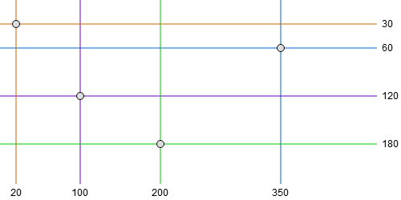
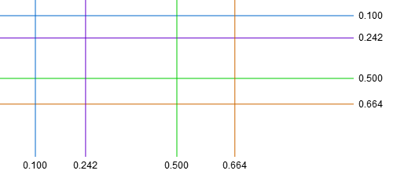

# d3fc-annotation

A collection of components for rendering plot area annotations onto cartesian charts - bands, crosshairs, gridlines and lines.

<table>
<tr>
<td><a href="#annotationGridline"></a></td>
<td><a href="#annotationCrosshair"></a></td>
</tr>
<tr>
<td><a href="#annotationBand"></a></td>
<td><a href="#annotationLine"></a></td>
</tr>
</table>

[Main d3fc package](https://github.com/ScottLogic/d3fc)

# Installation

```bash
npm install d3fc-annotation
```

# API

## Gridline Annotation

The gridline component renders horizontal and vertical gridlines.

<a name="annotationGridline" href="#annotationGridline">#</a> *fc*.**annotationGridline**()

Constructs a new gridline annotation component. Once constructed, configure the component with scales and call it on a selection -

```js
const xScale = d3.scaleLinear()
  .range([0, 100]);

const yScale = d3.scaleLinear()
  .range([0, 100]);

const gridline = fc.annotationGridline()
  .xScale(xScale)
  .yScale(yScale);

d3.select('svg')
  .call(gridline);
```

<a name="annotationGridline_xScale" href="#annotationGridline_xScale">#</a> *annotationGridline*.**xScale**(*[scale]*)

If *scale* is specified, sets the scale used for the vertical gridline positions (combined with [xTicks](#annotationGridline_xTicks)). Additionally, its [range](https://github.com/d3/d3-scale#continuous_range) is taken as the bounds of the horizontal gridlines. If *scale* is not specified, returns the current xScale.

<a name="annotationGridline_yScale" href="#annotationGridline_yScale">#</a> *annotationGridline*.**yScale**(*[scale]*)

If *scale* is specified, sets the scale used for the horizontal gridline positions (combined with [yTicks](#annotationGridline_yTicks)). Additionally, its [range](https://github.com/d3/d3-scale#continuous_range) is taken as the bounds of the vertical gridlines. If *scale* is not specified, returns the current yScale.

<a name="annotationGridline_xTicks" href="#annotationGridline_xTicks">#</a> *annotationGridline*.**xTicks**(*[count]*)

If *count* is specified, sets the count passed to [ticks](https://github.com/d3/d3-scale#continuous_ticks) when requesting the horizontal gridline positions when [xScale](#annotationGridline_xScale) is a continuous scale. For other scales, this value is ignored and the [domain](https://github.com/d3/d3-scale#ordinal_domain) is used directly. If *count* is not specified, returns the current count.

<a name="annotationGridline_xTickValues" href="#annotationGridline_xTickValues">#</a> *annotationGridline*.**xTickValues**(*[values]*)

Manually specify the vertical gridline positions. Overrides [xTicks](#annotationGridline_xTicks).

<a name="annotationGridline_yTicks" href="#annotationGridline_yTicks">#</a> *annotationGridline*.**yTicks**(*[count]*)

If *count* is specified, sets the count passed to [ticks](https://github.com/d3/d3-scale#continuous_ticks) when requesting the vertical gridline positions when [yScale](#annotationGridline_yScale) is a continuous scale. For other scales, this value is ignored and the [domain](https://github.com/d3/d3-scale#ordinal_domain) is used directly. If *count* is not specified, returns the current count.

<a name="annotationGridline_yTickValues" href="#annotationGridline_yTickValues">#</a> *annotationGridline*.**yTickValues**(*[args]*)

Manually specify the vertical gridline positions. Overrides [yTicks](#annotationGridline_yTicks).

<a name="annotationGridline_xKey" href="#annotationGridline_xKey">#</a> *annotationGridline*.**xKey**(*[fn]*)

If *fn* is specified, sets the key function used when joining the vertical gridlines to SVG elements. If not specified, returns the current key function.

<a name="annotationGridline_yKey" href="#annotationGridline_yKey">#</a> *annotationGridline*.**yKey**(*[fn]*)

If *fn* is specified, sets the key function used when joining the horizontal gridlines to SVG elements. If not specified, returns the current key function.

<a name="annotationGridline_xDecorate" href="#annotationGridline_xDecorate">#</a> *annotationGridline*.**xDecorate**(*[fn]*)

If *fn* is specified, sets the decorate function used when joining the vertical gridlines to SVG elements. If not specified, returns the current decorate function.

<a name="annotationGridline_yDecorate" href="#annotationGridline_yDecorate">#</a> *annotationGridline*.**yDecorate**(*[fn]*)

If *fn* is specified, sets the decorate function used when joining the horizontal gridlines to SVG elements. If not specified, returns the current decorate function.

## Band Annotation

The band component renders horizontal and vertical bands.

<a name="annotationBand" href="#annotationBand">#</a> *fc*.**annotationBand**()

Constructs a new band annotation component. Once constructed, configure the component with scales, associated a selection with some data representing the band locations and call it on the selection -

```js
const xScale = d3.scaleLinear()
  .range([0, 100]);

const yScale = d3.scaleLinear()
  .range([0, 100]);

const band = fc.annotationBand()
  .xScale(xScale)
  .yScale(yScale);

d3.select('svg')
  .datum([{ from: 45, to: 55 }])
  .call(band);
```

<a name="annotationBand_xScale" href="#annotationBand_xScale">#</a> *annotationBand*.**xScale**(*[scale]*)

If *scale* is specified, sets the scale used for transforming the [fromValue](#annotationBand_fromValue)/[toValue](#annotationBand_toValue) positions of vertical bands. Additionally, its [range](https://github.com/d3/d3-scale#continuous_range) is taken as the bounds of the horizontal bands. If *scale* is not specified, returns the current xScale.

<a name="annotationBand_yScale" href="#annotationBand_yScale">#</a> *annotationBand*.**yScale**(*[scale]*)

If *scale* is specified, sets the scale used for transforming the [fromValue](#annotationBand_fromValue)/[toValue](#annotationBand_toValue) positions of horizontal bands. Additionally, its [range](https://github.com/d3/d3-scale#continuous_range) is taken as the bounds of the vertical bands. If *scale* is not specified, returns the current yScale.

<a name="annotationBand_orient" href="#annotationBand_orient">#</a> *annotationBand*.**orient**(*[orientation]*)

If *orientation* is specified, sets the orientation of the bars to either `horizontal` or `vertical`. If *orientation* is not specified, returns the current orientation.

<a name="annotationBand_fromValue" href="#annotationBand_fromValue">#</a> *annotationBand*.**fromValue**(*[fn]*)

If *fn* is specified, sets the function used to retrieve the start value for bands. This value will be passed through the appropriate scale. If not specified, returns the current start value.

<a name="annotationBand_toValue" href="#annotationBand_toValue">#</a> *annotationBand*.**toValue**(*[fn]*)

If *fn* is specified, sets the function used to retrieve the end value for bands. This value will be passed through the appropriate scale. If not specified, returns the current end value.

<a name="annotationBand_decorate" href="#annotationBand_decorate">#</a> *annotationBand*.**decorate**(*[fn]*)

If *fn* is specified, sets the decorate function used when joining the bands to SVG elements. If not specified, returns the current decorate function.

## Line Annotation

The line component renders horizontal and vertical lines.

<a name="annotationLine" href="#annotationLine">#</a> *fc*.**annotationLine**()

Constructs a new line annotation component. Once constructed, configure the component with scales, associated a selection with some data representing the line locations and call it on the selection -

```js
const xScale = d3.scaleLinear()
  .range([0, 100]);

const yScale = d3.scaleLinear()
  .range([0, 100]);

const line = fc.annotationLine()
  .xScale(xScale)
  .yScale(yScale);

d3.select('svg')
  .datum([50])
  .call(line);
```

<a name="annotationLine_xScale" href="#annotationLine_xScale">#</a> *annotationLine*.**xScale**(*[scale]*)

If *scale* is specified, sets the scale used for transforming the [value](#annotationLine_value) of the line. Additionally, its [range](https://github.com/d3/d3-scale#continuous_range) is taken as the bounds of the horizontal lines. If *scale* is not specified, returns the current xScale.

<a name="annotationLine_yScale" href="#annotationLine_yScale">#</a> *annotationLine*.**yScale**(*[scale]*)

If *scale* is specified, sets the scale used for transforming the [value](#annotationLine_value) of the line. Additionally, its [range](https://github.com/d3/d3-scale#continuous_range) is taken as the bounds of the vertical lines. If *scale* is not specified, returns the current yScale.

<a name="annotationLine_orient" href="#annotationLine_orient">#</a> *annotationLine*.**orient**(*[orientation]*)

If *orientation* is specified, sets the orientation of the lines to either `horizontal` or `vertical`. If *orientation* is not specified, returns the current orientation.

<a name="annotationLine_value" href="#annotationLine_value">#</a> *annotationLine*.**value**(*[fn]*)

If *fn* is specified, sets the function used to retrieve the value for lines. This value will be passed through the appropriate scale. If not specified, returns the current value.

<a name="annotationLine_label" href="#annotationLine_label">#</a> *annotationLine*.**label**(*[fn]*)

If *fn* is specified, sets the function used to retrieve the label for lines. If not specified, returns the current label.

<a name="annotationLine_decorate" href="#annotationLine_decorate">#</a> *annotationLine*.**decorate**(*[fn]*)

If *fn* is specified, sets the decorate function used when joining the lines to SVG elements. If not specified, returns the current decorate function.

## Crosshair Annotation

The crosshair component renders a pair of vertical and horizontal lines with a point at their center.

<a name="annotationLine" href="#annotationLine">#</a> *fc*.**annotationLine**()

Constructs a new crosshair annotation component. Once constructed, configure the component with scales, associated a selection with some data representing the crosshair locations and call it on the selection -

```js
const xScale = d3.scaleLinear()
  .range([0, 100]);

const yScale = d3.scaleLinear()
  .range([0, 100]);

const crosshair = fc.annotationCrosshair()
  .xScale(xScale)
  .yScale(yScale);

d3.select('svg')
  .datum([{x: 50, y: 50}])
  .call(crosshair);
```

<a name="annotationLine_xScale" href="#annotationLine_xScale">#</a> *annotationLine*.**xScale**(*[scale]*)

If *scale* is specified, sets the scale whose [range](https://github.com/d3/d3-scale#continuous_range) is taken as the bounds of the horizontal lines. If *scale* is not specified, returns the current xScale.

<a name="annotationLine_yScale" href="#annotationLine_yScale">#</a> *annotationLine*.**yScale**(*[scale]*)

If *scale* is specified, sets the scale whose [range](https://github.com/d3/d3-scale#continuous_range) is taken as the bounds of the vertical lines. If *scale* is not specified, returns the current yScale.

<a name="annotationLine_x" href="#annotationLine_x">#</a> *annotationLine*.**x**(*[fn]*)

If *fn* is specified, sets the function used to retrieve the x position of the crosshair. N.B. this value will **not** be passed through the appropriate scale. If not specified, returns the current value.

<a name="annotationLine_y" href="#annotationLine_y">#</a> *annotationLine*.**y**(*[fn]*)

If *fn* is specified, sets the function used to retrieve the y position of the crosshair. N.B. this value will **not** be passed through the appropriate scale. If not specified, returns the current value.

<a name="annotationLine_xLabel" href="#annotationLine_xLabel">#</a> *annotationLine*.**xLabel**(*[fn]*)

If *fn* is specified, sets the function used to retrieve the label for vertical lines. If not specified, returns the current label.

<a name="annotationLine_yLabel" href="#annotationLine_yLabel">#</a> *annotationLine*.**yLabel**(*[fn]*)

If *fn* is specified, sets the function used to retrieve the label for horizontal lines. If not specified, returns the current label.

<a name="annotationLine_decorate" href="#annotationLine_decorate">#</a> *annotationLine*.**decorate**(*[fn]*)

If *fn* is specified, sets the decorate function used when joining the lines to SVG elements. If not specified, returns the current decorate function.
