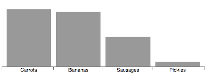

# d3fc-axis

A drop-in replacement for D3 axis, with support for the D3FC decorate pattern, improved layout options for ordinal scales, and automatic label rotation / re-positioning.

[Main D3FC package](https://github.com/d3fc/d3fc)

## Installing

```bash
npm install @d3fc/d3fc-axis
```

## API Reference

### General API

This is a drop-in replacement for [d3-axis](https://github.com/d3/d3-axis), so please refer to that project for detailed documentation - all of the d3-axis properties and features are supported by this component. A few additional properties have been added, which are documented below.

#### Tick and label layout options

#### Centred labels

When rendering an axis that is associated with a linear scale, the default behaviour for the axis is to render labels underneath each tick. This often makes the most sense, with the label indicating a specific instance on the scale.

However, in some cases the label may refer to a range of data. For example, on a time scale, 'Monday' refers to a time range rather than an instance in time. As a result, it makes more sense to render this label between the tick marks.

With the D3FC axis, setting `tickCenterLabel` to `true` will render the labels in between the tick marks, offsetting them to the right:

```
const linear = d3.scaleTime()
  .domain([new Date('2019-03-02'), new Date('2019-03-07')])
  .range([0, 400]);

const axis = fc.axisBottom(linear)
  .tickArguments([5])
  .tickCenterLabel(true);
```


##### Band scales

Band scales are often used for rendering charts with a categorical dimension. With the D3 axis, the ticks and labels are rendered at the central point of each bar / column. However, it can make more sense to render the ticks at the boundary between each bar / category.

The D3FC ordinal axis is a drop-in replacement that renders the labels at the central point of the bar / column, and the ticks at the boundaries:

```
const vegetableScale = d3.scaleBand()
  .domain(['Carrots', 'Bananas', 'Sausages', 'Pickles'])
  .paddingInner(0.1)
  .paddingOuter(0.1)
  .range([0, width]);

const barSeries = fc.autoBandwidth(fc.seriesSvgBar())
  .align('left')
  .crossValue(x => x.veg)
  .mainValue(x => x.qty)
  .xScale(vegetableScale)
  .yScale(qtyScale);

// this is the D3FC ordinal axis
const axis = fc.axisOrdinalBottom(scale);

// render the above components to SVG ...
var svg = d3.select('body').append('svg')
...
```



#### Label rotation / offset

With the D3 axis, if tick marks are too close together, their associated labels might overlap. With D3FC you can apply an adapter to the axis in order to automatically move / rotate labels in order to avoid collisions.

Here's a simple example where the axis labels overlap:

```
const foodScale = d3.scaleBand()
    .domain(['Carrots', 'Bananas', 'Sausages', 'Pickles', 'Aubergines', 'Artichokes', 'Spinach', 'Cucumber'])
    .range([10, 290]);

const axis = fc.axisOrdinalBottom(foodScale);

d3.select('svg')
    .call(axis);
```

The overlap can be avoided by applying one of the adapters, for example you can apply the `axisLabelRotate` adapter as follows:

```
const axis = fc.axisLabelRotate(fc.axisOrdinalBottom(foodScale));
```

Each time the axis is rendered this adapter measures the labels and determines whether they need to be rotated in order to avoid collisions. With this example the axis renders as follows:


#### Decorate pattern

Components that implement the decorate pattern expose a `decorate` property which is passed the data join selection used to construct the component's DOM. This allows users of the component to add extra logic to the enter, update and exit selections.

For further details, consult the [Decorate Pattern documentation](https://d3fc.io/introduction/decorate-pattern.html).

In the example below, the value bound to each tick is used to colour values greater than or equal to 100:

```
const scale = d3.scaleLinear()
  .domain([0, 140])
  .range([0, 400])
  .nice();

const axis = fc.axisBottom(scale)
  .decorate((s) =>
    s.enter()
      .select('text')
      .style('fill', function(d) {
          return d >= 100 ? 'red' : 'black';
      });
  );
```


### Axis

<a name="axisBottom" href="#axisBottom">#</a> fc.**axisBottom**()
<a name="axisTop" href="#axisTop">#</a> fc.**axisTop**()
<a name="axisLeft" href="#axisLeft">#</a> fc.**axisLeft**()
<a name="axisRight" href="#axisRight">#</a> fc.**axisRight**()

A drop-in replacement for D3 axis, see the [D3 documentation for API reference](https://github.com/d3/d3-axis#api-reference).

### Ordinal Axis


<a name="axisOrdinalBottom" href="#axisOrdinalBottom">#</a> fc.**axisOrdinalBottom**()
<a name="axisOrdinalTop" href="#axisOrdinalTop">#</a> fc.**axisOrdinalTop**()
<a name="axisOrdinalLeft" href="#axisOrdinalLeft">#</a> fc.**axisOrdinalLeft**()
<a name="axisOrdinalRight" href="#axisOrdinalRight">#</a> fc.**axisOrdinalRight**()

A drop-in replacement for D3 axis, see the [D3 documentation for API reference](https://github.com/d3/d3-axis#api-reference).

### Axis Label Offset


<a name="axisLabelOffset" href="#axisLabelOffset">#</a> fc.**axisLabelOffset**(*axis*)

An adapter that offsets axis labels in order to avoid collisions.

<a name="axisLabelOffset_labelOffsetDepth" href="#axisLabelOffset_labelOffsetDepth">#</a> *axis*.**labelOffsetDepth**(*offset*)

If *offset* is specified, sets the offset depth and returns this series. If *offset* is not specified, returns the current offset depth.

If *offset* is set to `auto`, the adapter will determine the required offset depth (i.e. number of levels) that labels need to be offset by in order to avoid collisions. If *offset* is set to a number, it will offset labels by the given depth.

### Axis Label Rotate


<a name="axisLabelRotate" href="#axisLabelRotate">#</a> fc.**axisLabelRotate**(*axis*)

An adapter that rotates axis labels in order to avoid collisions.

<a name="axisLabelRotate_labelRotate" href="#axisLabelRotate_labelRotate">#</a> *axis*.**labelRotate**(*degrees*)

If *degrees* is specified, sets the rotation angle in degrees. If *degrees* is not specified, returns the current rotation angle.

If *degrees* is set to `auto`, the adapter will determine whether the labels will overlap then rotate them to avoid collisions. Depending on the available space, the angle will vary from fairly shallow, all the way up to 90 degrees. If *degrees* is set to a number, it will rotate labels by the given angle.
