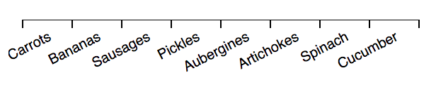

# d3fc-axis

A drop-in replacement for d3 axis, with support for the d3fc decorate pattern, and improved layout options for ordinal scales.

[Main d3fc package](https://github.com/d3fc/d3fc)

## Installing

```bash
npm install @d3fc/d3fc-axis
```

## API Reference

This is a drop-in replacement for [d3-axis](https://github.com/d3/d3-axis), so please refer to that project for detailed documentation - all of the d3-axis properties and features are supported by this component. A few additional properties have been added, which are documented below.

## Tick and label layout options

### Centred labels

When rendering an axis that is associated with a linear scale, the default behaviour for the axis is to render labels underneath each tick. This often makes the most sense, with the label indicating a specific instance on the scale.

However, in some cases the label may refer to a range of data. For example, on a time scale, 'Monday' refers to a time range rather than an instance in time. As a result, it makes more sense to render this label between the tick marks.

With the d3fc axis, setting `tickCenterLabel` to `true` will render the labels in between the tick marks, offsetting them to the right:

```
const linear = d3.scaleTime()
  .domain([new Date('2019-03-02'), new Date('2019-03-07')])
  .range([0, 400]);

const axis = fc.axisBottom(linear)
  .tickArguments([5])
  .tickCenterLabel(true);
```


### Band scales

Band scales are often used for rendering charts with a categorical dimension. With the d3 axis, the ticks and labels are rendered at the central point of each bar / column. However, it can make more sense to render the ticks at the boundary between each bar / category.

The d3fc ordinal axis is a drop-in replacement that renders the labels at the central point of the bar / column, and the ticks at the boundaries:

```
const vegetableScale = d3.scaleBand()
  .domain(['Carrots', 'Bananas', 'Sausages', 'Pickles'])
  .paddingInner(0.1)
  .paddingOuter(0.1)
  .range([0, width]);

const barSeries = fc.autoBandwidth(fc.seriesSvgBar())
  .align('left')
  .crossValue(x => x.veg)
  .mainValue(x => x.qty)
  .xScale(vegetableScale)
  .yScale(qtyScale);

// this is the d3fc ordinal axis
const axis = fc.axisOrdinalBottom(scale);

// render the above components to SVG ...
var svg = d3.select('body').append('svg')
...
```


## Decorate pattern

Components that implement the decorate pattern expose a `decorate` property which is passed the data join selection used to construct the component's DOM. This allows users of the component to add extra logic to the enter, update and exit selections.

For further details, consult the [Decorate Pattern documentation](https://d3fc.io/introduction/decorate-pattern.html).

### Examples

The decorate pattern can be used to rotate the tick labels:

```
const scale = d3.scaleBand()
  .domain(['Carrots', 'Bananas', 'Sausages', 'Pickles', 'Aubergines', 'Artichokes', 'Spinach', 'Cucumber'])
  .range([0, 400]);

const axis = fc.axisBottom(scale)
  .decorate(s =>
      s.enter().select('text')
        .style('text-anchor', 'start')
        .attr('transform', 'rotate(45 -10 10)')
  );
```



Or alternatively the tick index can be used to offset alternating labels:

```
const scale = d3.scaleBand()
  .domain(['Carrots', 'Bananas', 'Sausages', 'Pickles', 'Aubergines', 'Artichokes', 'Spinach', 'Cucumber'])
  .range([0, 400]);

const axis = fc.axisBottom(scale)
  .decorate(s =>
    s.enter()
      .select('text')
      .style('transform', (d, i) => i % 2 === 0  ? 'translate(0 20)' : '');
  );
```


In the example below, the value bound to each tick is used to colour values greater than or equal to 100:

```
const scale = d3.scaleLinear()
  .domain([0, 140])
  .range([0, 400])
  .nice();

const axis = fc.axisBottom(scale)
  .decorate((s) =>
    s.enter()
      .select('text')
      .style('fill', function(d) {
          return d >= 100 ? 'red' : 'black';
      });
  );
```

