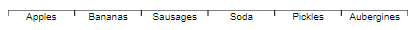

# d3fc-axis

A drop-in replacement for d3 axis, with support for the d3fc decorate pattern.

[Main d3fc package](https://github.com/d3fc/d3fc)

## Installing

```bash
npm install @d3fc/d3fc-axis
```

## API Reference

This is a drop-in replacement for [d3-axis](https://github.com/d3/d3-axis), so please refer to that project for detailed documentation.

## Decorate pattern

Components that implement the decorate pattern expose a `decorate` property which is passed the data join selection used to construct the component's DOM. This allows users of the component to add extra logic to the enter, update and exit selections.

For further details, consult the [Decorate Pattern documentation](https://d3fc.io/introduction/decorate-pattern.html).

### Examples

The decorate pattern can be used to rotate the tick labels:

```
const scale = d3.scaleBand()
  .domain(['Carrots', 'Bananas', 'Sausages', 'Pickles', 'Aubergines', 'Artichokes', 'Spinach', 'Cucumber'])
  .range([0, 400]);

const axis = fc.axisBottom(scale)
  .decorate(s =>
      s.enter().select('text')
        .style('text-anchor', 'start')
        .attr('transform', 'rotate(45 -10 10)')
  );
```


Or alternatively the tick index can be used to offset alternating labels:

```
const scale = d3.scaleBand()
  .domain(['Carrots', 'Bananas', 'Sausages', 'Pickles', 'Aubergines', 'Artichokes', 'Spinach', 'Cucumber'])
  .range([0, 400]);

const axis = fc.axisBottom(scale)
  .decorate(s =>
    s.enter()
      .select('text')
      .style('transform', (d, i) => i % 2 === 0  ? 'translate(0 20)' : '');
  );
```


In the example below, the value bound to each tick is used to colour values greater than or equal to 100:

```
const scale = d3.scaleLinear()
  .domain([0, 140])
  .range([0, 400])
  .nice();

const axis = fc.axisBottom(scale)
  .decorate((s) =>
    s.enter()
      .select('text')
      .style('fill', function(d) {
          return d >= 100 ? 'red' : 'black';
      });
  );
```


In the example below, the tick labels are centered between the tick lines:

```
const linear = d3.scaleTime()
  .domain([new Date('2019-03-02'), new Date('2019-03-07')])
  .range([margin, width - margin]);

const axis = fc.axisBottom(linear)
  .tickArguments([5])
  .tickCenterLabel(true);
```


In the example below, the tick lines are aligned to the right on a ordinal scale:

```
const scale = d3.scaleBand()
  .domain(['Apples', 'Bananas', 'Sausages', 'Soda', 'Pickles', 'Aubergines'])
  .range([0, 400]);

const axis = fc.axisOrdinalBottom(scale);
```


