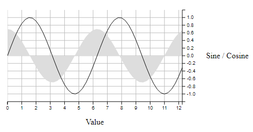

# d3fc-chart

A simple Cartesian chart component that renders to canvas or SVG.


[Main D3FC package](https://github.com/d3fc/d3fc)

## Installing

```bash
npm install @d3fc/d3fc-chart
```

## API Reference

### General API

D3FC provides a number of components / building blocks that make it easier to build bespoke D3 charts, using SVG and canvas. If you just need a simple Cartesian chart, this package is a good starting point, providing a simple component that is itself built using components from the other D3FC packages ([d3fc-element](https://github.com/d3fc/d3fc/tree/master/packages/d3fc-element#d3fc-element), [d3fc-data-join](https://github.com/d3fc/d3fc/tree/master/packages/d3fc-data-join#d3fc-data-join), [d3fc-axis](https://github.com/d3fc/d3fc/tree/master/packages/d3fc-axis#d3fc-axis), [d3fc-series](https://github.com/d3fc/d3fc/tree/master/packages/d3fc-series#d3fc-series), etc ...).

Given the following div:

```html
<div id="sine" style="width: 500px; height: 250px"></div>
```

The following code renders a Cartesian chart:

```javascript
var data = d3.range(50).map((d) => ({
    x: d / 4,
    y: Math.sin(d / 4),
    z: Math.cos(d / 4) * 0.7
}));

// use d3fc-extent to compute the domain for each axis
var xExtent = fc.extentLinear()
  .accessors([d => d.x]);
var yExtent = fc.extentLinear()
  .accessors([d => d.y, d => d.z])
  .pad([0.1, 0.1])

// gridlines (from d3fc-annotation)
// n.b. the gridlines are rendered using SVG
var gridlines = fc.annotationSvgGridline();
// series (from d3fc-series)
// n.b. the series are rendered using canvas
var line = fc.seriesCanvasLine();
var area = fc.seriesCanvasArea()
  .mainValue(d => d.z);

// combine into a single series
var multi = fc.seriesCanvasMulti()
  .series([area, line]);

// the Cartesian component, which uses d3fc-element for layout
// of the standard features of a chart (axes, labels, plot area)
var chart = fc.chartCartesian(
    d3.scaleLinear(),
    d3.scaleLinear()
  )
  .xLabel('Value')
  .yLabel('Sine / Cosine')
  .chartLabel('Sine and Cosine')
  .yDomain(yExtent(data))
  .xDomain(xExtent(data))
  .svgPlotArea(gridlines)
  .canvasPlotArea(multi);

// render
d3.select('#sine')
  .datum(data)
  .call(chart);
```

Rendering the following:



The chart is constructed using a pair of scales. The scale configuration properties are rebound (i.e. re-exposed) via the chart component with `x` and `y` prefixes. The chart takes care of layout, and will also re-render if the size of the containing element changes.

### Styles

The component automatically injects a stylesheet to apply the necessary CSS to the elements. These styles can be augmented with CSS -

```css
d3fc-group.cartesian-chart > .x-label {
  line-height: 5em;
  color: red;
}
```

Or through decoration -

```javascript
chart.decorate(selection => {
  selection.enter()
    .select('.x-label')
    .style('line-height', '5em')
    .style('color', 'red')
});
```

### Grid

Internally, the component uses CSS grid layout to arrange the various rendering surfaces and labels. The following diagram shows the grid structure and associated line indicies -

```
  1             2           3               4            5              6
1 /-------------|-----------|---------------|------------|--------------\
  |             |           |   top gutter  |            |              |
2 |-------------|-----------|---------------|------------|--------------|
  |             |           |    top axis   |            |              |
3 |-------------|-----------|---------------|------------|--------------|
  | left gutter | left axis |   plot area   | right axis | right gutter |
4 |-------------|-----------|---------------|------------|--------------|
  |             |           |  bottom axis  |            |              |
5 |-------------|-----------|---------------|------------|--------------|
  |             |           | bottom gutter |            |              |
6 \-------------|-----------|---------------|------------|--------------/
```

Additional elements can be dropped into this grid, either in-place of or in addition to the existing elements using decoration. The following are some typical examples of this process.

N.B. Each of these examples uses the modern CSS grid specification syntax. To make these work in legacy versions of IE, you'll need to additionally set the following equivalent prefixed properties -

* `grid-column` - `-ms-grid-column`
* `grid-row` - `-ms-grid-row`

#### Using custom axis components

By default the chart uses d3fc-axis for the axis component. This example shows how to specify which axis components to use for the X and Y axis.

```javascript
var chart = fc.chartCartesian({
    xScale: d3.scaleLinear(),
    yScale: d3.scaleLinear(),
    xAxis: {
      bottom: myCustomAxis
    },
    yAxis: {
      left: fc.axisLeft
    }
  })
  .xLabel('Value')
  .yLabel('Sine / Cosine')
  .yOrient('left')
  .yDomain(yExtent(data))
  .xDomain(xExtent(data))
  .canvasPlotArea(series);
```

#### Adding a Second Axis

By default the chart allows a left or a right axis (see [xOrient](#cartesian_xOrient)) but not both. This example shows how we can add in another using decoration -

```javascript
// create a scale for the second axis
var zScale = d3.scaleLinear()
  .domain([-1000, 1000]);
// create an axis for the scale
var zAxis = d3.axisRight(zScale);

chart.decorate(selection => {
  // when the chart is added to the DOM
  selection.enter()
    // additionally add a d3fc-svg element for the axis
    .append('d3fc-svg')
    // move the element into the right-axis cell
    .style('grid-column', 4)
    .style('grid-row', 3)
    // and set the axis width
    .style('width', '3em')
    // when there's a measure event (namespaced to avoid removing existing handlers)
    .on('measure.z-axis', () => {
      // set the range on the scale to the elements height
      zScale.range([d3.event.detail.height, 0]);
    })
    .on('draw.z-axis', (d, i, nodes) => {
      // draw the axis into the svg within the d3fc-svg element
      d3.select(nodes[i])
        .select('svg')
        .call(zAxis);
    });
});
```

#### Translating the Y-Axis

More radical changes to the chart's structure can also be performed using decoration -

```javascript
chart.decorate(selection => {
  // select the x-axis
  selection.select('.x-axis')
    // move it into the plot-area
    .style('grid-row', 3)
    // listen for the draw event (using a namespace to avoid removing any existing handlers)
    .on('draw.move-axis', (d, i, nodes) => {
      // select the x-axis
      d3.select(nodes[i])
        // apply a top margin to the axis to align it to 0 on the y-axis
        .style('margin-top', `${yScale(0)}px`);
    });

  // optionally: add some padding to fill the gap left by the x-axis
  selection.select('.x-label')
    .style('padding-top', '1em');
});

// optionally: re-position the x-axis tick labels so they're readable
chart.xDecorate(selection => {
  selection.select('text')
    .attr('transform', 'translate(-7, 7)');
});
```

#### Changing the z-order of plot areas

By default the z-order of the plot areas is webgl at the back, canvas in the middle and svg on top. This is to accomodate the most common use-case of supporting more interactive components being drawn in the foreground with less interactive components being drawn in the background.

Interactivity in this case means responding directly to user input to for example draw annotations or highlight data elements. It is typically easier to develop these components using svg (due to its richer user-initiated events model) or canvas (due to its simpler API).

Where this z-ordering is not appropriate, it is possible to modify the order using decorate -

```javascript
chart.decorate(selection => {
  // using the enter selection to ensure this only runs once, select each plot area node
  const svgPlotArea = selection.enter()
    .select('.svg-plot-area')
    .node();
  const canvasPlotArea = selection.enter()
    .select('.canvas-plot-area')
    .node();
  const webglPlotArea = selection.enter()
    .select('.webgl-plot-area')
    .node();
  // create a selection of the nodes in the required order
  d3.selectAll([canvasPlotArea, svgPlotArea, webglPlotArea])
    // order the nodes in the DOM by their selection order
    .order();
});
```

### Cartesian

<a name="chartCartesian" href="#chartCartesian">#</a> fc.**chartCartesian**(*xScale*, *yScale*)

Constructs a new Cartesian chart with the given scales.

<a name="chartCartesianSettings" href="#chartCartesianSettings">#</a> fc.**chartCartesian**({ xScale: *xScale*, yScale: *yScale*, xAxis: axisFactory, yAxis: axisFactory })

Constructs a new Cartesian chart with the given scales and axis components.

If *xAxis* is specified, it must be an object with the required x-axis factory function (*top* if *xOrient*="top" or *bottom* if *xOrient*="bottom").

If *yAxis* is specified, it must be an object with the required y-axis factory function (*left* if *yOrient*="left" or *right* if *yOrient*="right").

<a name="cartesian_svgPlotArea" href="#cartesian_svgPlotArea">#</a> *cartesian*.**svgPlotArea**(*component*)
<a name="cartesian_canvasPlotArea" href="#cartesian_canvasPlotArea">#</a> *cartesian*.**canvasPlotArea**(*component*)
<a name="cartesian_webglPlotArea" href="#cartesian_webglPlotArea">#</a> *cartesian*.**webglPlotArea**(*component*)

If *component* is specified, sets the component to render onto the SVG/canvas, and returns the Cartesian chart. If *component* is not specified, returns the existing component.

If *canvasPlotArea* or *webglPlotArea* is used, the relavent *context* is automatically applied to the chart.

For series that contain a very high number of data-points, rendering to canvas can reduce the rendering time and improve performance. For components that require user-interaction, rendering to SVG can simplify their implementation.

<a name="cartesian_useDevicePixelRatio" href="#cartesian_useDevicePixelRatio">#</a> *cartesian*.**useDevicePixelRatio**(*value*)

If the boolean *value* is specified, sets whether the Canvas / WebGL should be scaled based on the resolution of the display device, and returns the Cartesian chart. If *value* is not specified, returns the current value.

<a name="cartesian_chartLabel" href="#cartesian_chartLabel">#</a> *cartesian*.**chartLabel**(*label*)
<a name="cartesian_xLabel" href="#cartesian_xLabel">#</a> *cartesian*.**xLabel**(*label*)
<a name="cartesian_yLabel" href="#cartesian_yLabel">#</a> *cartesian*.**yLabel**(*label*)

If *label* is specified, sets the text for the given label, and returns the Cartesian chart. If *label* is not specified, returns the label text.

The *label* value can either be a string, or a function that returns a string. If it is a function, it will be invoked with the data that is 'bound' to the chart. This can be useful if you are rendering multiple charts using a data join.

<a name="cartesian_xAxisHeight" href="#cartesian_xAxisHeight">#</a> *cartesian*.**xAxisHeight**(*height*)

If *height* is specified, sets the height for the x-axis, and returns the Cartesian chart. If *height* is not specified, returns the x-axis height or null if not set. The value should be a string with units (e.g. "2em").

The *height* value can either be a string, or a function that returns a string. If it is a function, it will be invoked with the data that is 'bound' to the chart. This can be useful if you are rendering multiple charts using a data join.

<a name="cartesian_yAxisWidth" href="#cartesian_yAxisWidth">#</a> *cartesian*.**yAxisWidth**(*width*)

If *width* is specified, sets the width for the y-axis, and returns the Cartesian chart. If *width* is not specified, returns the y-axis width or null if not set. The value should be a string with units (e.g. "2em").

The *width* value can either be a string, or a function that returns a string. If it is a function, it will be invoked with the data that is 'bound' to the chart. This can be useful if you are rendering multiple charts using a data join.

<a name="cartesian_xOrient" href="#cartesian_xOrient">#</a> *cartesian*.**xOrient**(*orient*)
<a name="cartesian_yOrient" href="#cartesian_yOrient">#</a> *cartesian*.**yOrient**(*orient*)

If *orient* is specified, sets the orientation for the axis in the given direction, and returns the Cartesian chart. If *orient* is not specified, returns the orientation. Valid values for *yOrient* are *left*, *right* or *none*, and for *xOrient* they are *top*, *bottom* or *none*.

If an orientation of *none* is specified for an axis, the axis, axis label and their containers will not be rendered.

The *orient* value can either be a string, or a function that returns a string. If it is a function, it will be invoked with the data that is 'bound' to the chart. This can be useful if you are rendering multiple charts using a data join.

<a name="cartesian_decorate" href="#cartesian_decorate">#</a> *cartesian*.**decorate**(*decorateFunc*)

If *decorateFunc* is specified, sets the decorator function to the specified, and returns the Cartesian chart. If *decorateFunc* is not specified, returns the current decorator function.

<a name="cartesian_xDomain" href="#cartesian_xDomain">#</a> *cartesian*.**xDomain**(...)
<a name="cartesian_yDomain" href="#cartesian_yDomain">#</a> *cartesian*.**yDomain**(...)
<a name="cartesian_xNice" href="#cartesian_xNice">#</a> *cartesian*.**xNice**(...)
...

The Cartesian chart exposes the scale properties with either an `x` or `y` prefix.


<a name="cartesian_xTicks" href="#cartesian_xTicks">#</a> *cartesian*.**xTicks**(...)
<a name="cartesian_xTickFormat" href="#cartesian_xTickFormat">#</a> *cartesian*.**xTickFormat**(...)
<a name="cartesian_xDecorate" href="#cartesian_xDecorate">#</a> *cartesian*.**xDecorate**(...)
<a name="cartesian_yTicks" href="#cartesian_yTicks">#</a> *cartesian*.**yTicks**(...)
<a name="cartesian_yTickFormat" href="#cartesian_yTickFormat">#</a> *cartesian*.**yTickFormat**(...)
<a name="cartesian_yDecorate" href="#cartesian_yDecorate">#</a> *cartesian*.**yDecorate**(...)
...

The Cartesian chart exposes the [d3fc-axis](https://github.com/d3fc/d3fc/tree/master/packages/d3fc-axis#d3fc-axis) *ticks*, *tickSize*, *tickValue*, *tickFormat*, *tickArguments*, *tickSizeInner*, *tickSizeOuter*, *tickPadding*, *tickCenterLabel* and *decorate* properties with either an `x` or `y` prefix.
