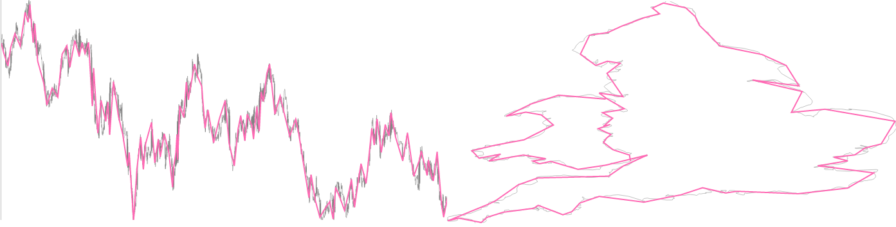

# d3fc-sample

A D3 sampler that subsamples data through largest triangle and mode-median bucket methods. Data is typically partitioned into equally-sized buckets, and one data point from each bucket is chosen. The algorithms employed here are detailed in the thesis [Downsampling Time Series for Visual Representation](http://skemman.is/stream/get/1946/15343/37285/3/SS_MSthesis.pdf).




For a live demo, see the [GitHub Pages site](http://d3fc.github.io/d3fc-sample/).

[Main d3fc package](https://github.com/ScottLogic/d3fc)

# Installation

```bash
npm install d3fc-sample
```

# API

## General API

The sample component provides an API to subsample data based off of their values, typically to improve performance on high-data charts. The data is passed to the component, which then returns their subsampled counterpart.

## Example usage

```javascript
// Create the sampler
var sampler = fc.data.sampler.largestTriangleThreeBucket();

// Configure the x/y positions the sampler uses to check shapes
sampler.x(function (d) { return d.x; })
    .y(function (d) { return d.y; });

// Configure the size of the buckets used to subsample the data.
sampler.bucketSize(10);

// Run the sampler
var subsampledData = sampler(data);
```

## Mode Median

The mode-median sampler is fairly basic. It partitions the data, then selects a representative piece of data from that set: the mode -- if it exists -- or the median.

---

*fc.data.sampler*.**modeMedian**()

Constructs a new sampler.

---

*modeMedian*.**value**(*accessor*)

Specifies the 'value' for each item in the associated array.

---

*modeMedian*.**bucketSize**(*size*)

Denotes the amount of data points for each bucket. The first and last data points are always their own bucket. The second-last bucket will be of size `(data.length - 2) % size`.

---

**modeMedian**(*data*)

Runs the subsampler. It returns the subsampled data (it doesn't modify the `data` array itself). The subsampler selects the mode (if it exists), or the median value.

## Largest Triangle

The largest triangle algorithm comes in two flavours -- one bucket and three bucket. The one bucket implementation, for each bucket, selects the point with the largest difference between its neighbours. The three bucket implementation, for each bucket, selects the point with the largest area between the last selected point and the average of the next bucket's values.

---

*fc.data.sampler*.**largestTriangleOneBucket**()

*fc.data.sampler*.**largestTriangleThreeBucket**()

Constructs a new sampler. The API is the same for both samplers, aside from this constructor.

---

*largestTriangle*.**x**(*accessor*)

*largestTriangle*.**y**(*accessor*)

Specifies the x/y value for each item in the associated array, used to calculate the area between points.

---

*largestTriangle*.**bucketSize**(*size*)

Denotes the amount of data points for each bucket. The first and last data points are always their own bucket. The second-last bucket will be of size `(data.length - 2) % size`.

---

**largestTriangle**(*data*)

Runs the subsampler. It returns the subsampled data (it doesn't modify the `data` array itself). The subsampler selects the point in the bucket with the largest area between two other points (determined by algorithm).

## Bucket

d3fc-sample also comes with a data bucket utility, used by the algorithms. It partitions data into evenly-sized chunks, with the first and last bucket being their own.

*fc.data.sampler*.**bucket**()

Construct a data bucket utility instance.

---

*bucket*.**bucketSize**(*size*)

Denotes the amount of data points for each bucket. The first and last data points are always their own bucket. The second-last bucket will be of size `(data.length - 2) % size`.

---

**bucket**(*data*)

Partitions the data into evenly sized buckets, in the form:

```
[
    [data[0]],
    [data[1], data[2], ..., data[n]],
    [data[n + 1], data[n + 2], ..., data[2n]],
    ...
    [data[data.length - 1]]
]
```
