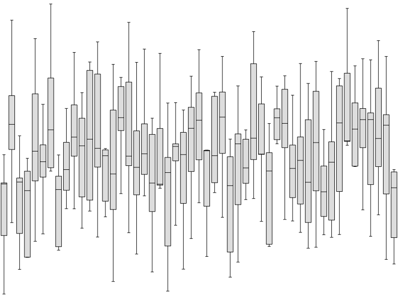
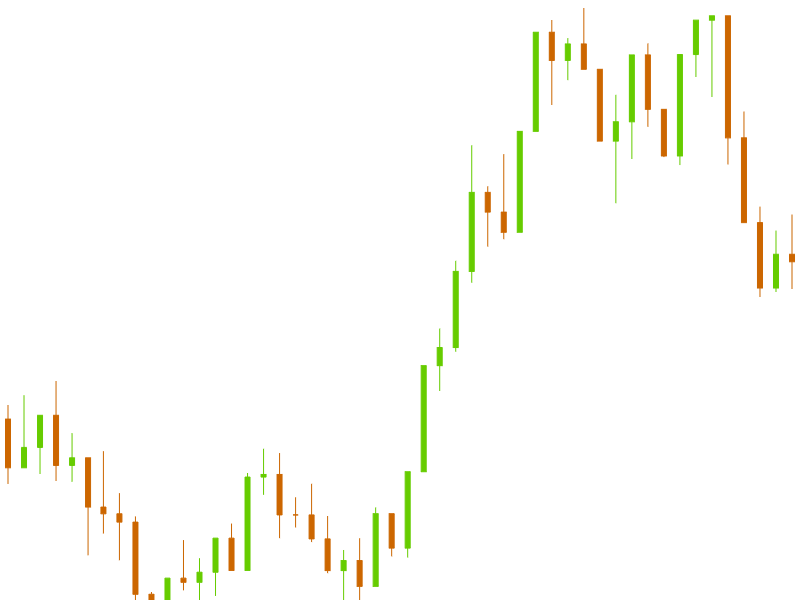
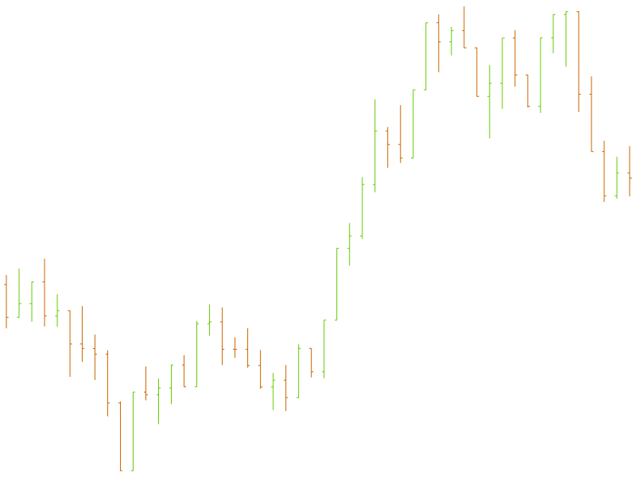
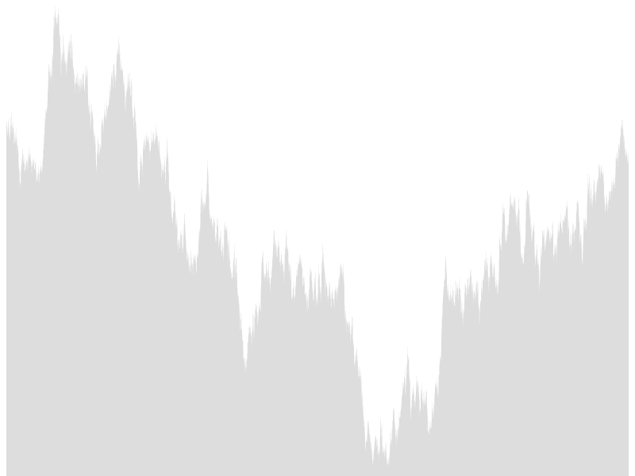
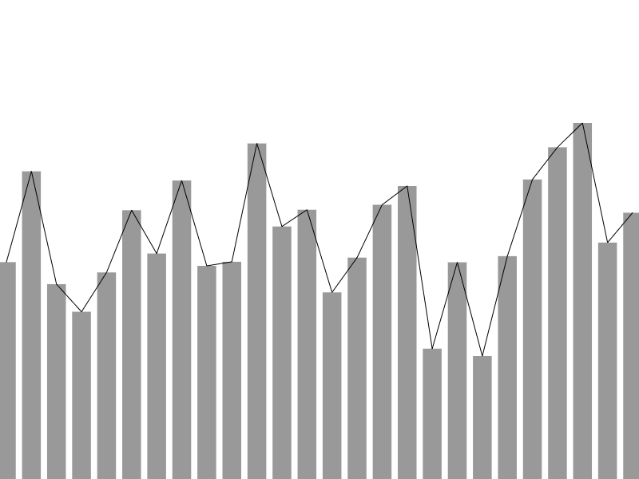

# d3fc-series

A collection of components for rendering data series to SVG and canvas, including line, bar, OHLC, candlestick and more.

<table>
<tr>
  <td><a href="#boxplot"></a></td>
  <td><a href="#candlestick"></a></td>
  <td><a href="#line"></a></td>
</tr>
<tr>
  <td><a href="#ohlc"></a></td>
  <td><a href="#area"></a></td>
  <td><a href="#point"></a></td>
</tr>
<tr>
  <td><a href="#bar"></a></td>
  <td><a href="#errorbar"></a></td>
  <td><a href="#multi"></a></td>
</tr>
</table>

[Main d3fc package](https://github.com/ScottLogic/d3fc)

# Installation

```bash
npm install d3fc-series
```

# API

## General API

This packages contains a number of D3 components that render various standard series types. They all share a common API, with the typical configuration requiring x and y scales together with a number of value accessors. There are SVG and Canvas versions of each series type, sharing the same configuration properties.

### SVG rendering

In order to render a line series to SVG, the data should be supplied via a data-join or `datum`, as follows:

```javascript
const data = [
    {x: 0, y: 0},
    {x: 10, y: 5},
    {x: 20, y: 0}
];

const line = fc.seriesSvgLine()
    .crossValue(d => d.x)
    .mainValue(d => d.y)
    .xScale(xScale)
    .yScale(yScale);

d3.select('g')
    .datum(data)
    .call(line);
```

The line component is configured with the required value accessors and scales. In this case, the supplied data has `x` and `y` properties. The value accessors are invoked on each datum within the array, and simply obtain the value for their respective property. The scales are used to convert the values in the domain coordinate system (as returned by the accessors), to the screen coordinate system.

The series is rendered into a group (`g`) element by first selecting it, using `datum` to associate the data with this DOM node, then using `call` to invoke the series component, causing it to be rendered.


### Canvas rendering

The `seriesCanvasLine` component has an API that is almost identical to its SVG counterpart, `seriesSvgLine`, the only difference is the addition of a `context` property, which is set to the context of the canvas that this series renders to.

```javascript
const data = [
    {x: 0, y: 0},
    {x: 10, y: 5},
    {x: 20, y: 0}
];

var ctx = canvas.getContext('2d');

const line = fc.seriesCanvasLine()
    .crossValue(d => d.x)
    .mainValue(d => d.y)
    .xScale(xScale)
    .yScale(yScale)
    .context(ctx);

line(data);
```

Because D3 data-joins and data-binding only work on HTML / SVG, the canvas components are invoked directly with the supplied data. This causes the component to render itself to the canvas.


### Decoration

// TODO: Add some documentation around how decorate works.

### Orientation

Most of the series renderers support both horizontal and vertical render orientations as specified by the `orient` property. In order to make it easy to change the orientation of a series, and to avoid redundant and repeated property names, a change in orientation is achieved by transposing the x and y scales.

The following example shows a simple bar series rendered in its default vertical orientation:

```javascript
const data = [4, 6, 8, 6, 0, 10];

const xScale = d3.scaleLinear()
    .domain([0, data.length])
    .range([0, width]);

const yScale = d3.scaleLinear()
    .domain([0, 10])
    .range([height, 0]);

const barSeries = fc.seriesSvgBar()
    .xScale(xScale)
    .yScale(yScale)
    .crossValue((_, i) => i)
    .mainValue((d) => d);

d3.select('g')
    .datum(data)
    .call(svgBar);
```

By setting its `orient` property to `horizontal`, the x and y scales are transposed. As a result, the domain for both the x and y scale have to be switched. The following shows the changes required:

```javascript
const xScale = d3.scaleLinear()
    .domain([0, 10])           // domain changed
    .range([0, width]);

const yScale = d3.scaleLinear()
    .domain([0, data.length])  // domain changed
    .range([height, 0]);

const barSeries = fc.seriesSvgBar()
    .xScale(xScale)
    .yScale(yScale)
    .orient('horizontal')      // orient property updated
    .crossValue((_, i) => i)
    .mainValue((d) => d);
```

This is part of the motivation behind naming the accessors `mainValue` and `crossValue`, rather than an orientation specific `xValue` / `yValue`.

### Multi series

One series type that is worthy of note is the multi series. This component provides a convenient way to render multiple series, that share scales, to the same SVG or canvas.

The multi series renderers expose a `series` property which accepts an array of series renderers, and `xScale` and `yScale` properties. The following example shows how a multi series can be used to render both a line and bar series:

```javascript
// a couple of series - value accessor configuration omitted for clarity
const barSeries = fc.seriesSvgBar();
const lineSeries = fc.seriesSvgLine();

const multiSeries = fc.seriesSvgMulti()
    .xScale(xScale)
    .yScale(yScale)
    .series([barSeries, lineSeries]);

d3.select('g')
    .datum(data)
    .call(svgMulti);
```

Notice that you do not have to set the `xScale` and `yScale` properties on each series - the scale are propagated down from the multi series.

The canvas API is very similar:

```javascript
// a couple of series - value accessor configuration omitted for clarity
const barSeries = fc.seriesCanvasBar();
const lineSeries = fc.seriesCanvasLine();

const multiSeries = fc.seriesCanvasMulti()
    .xScale(xScale)
    .yScale(yScale)
    .context(ctx)
    .series([barSeries, lineSeries]);

multiSeries(data)
```

In this case the context is also propagated from the multi series to the children.


## Fractional bar width

A number of the series (bar, OHLC, boxplot) have a notion of 'width'. They all expose a `barWidth` property where you can supply the width as a value (in the screen coordinate system), or a function which is invoked with an array containing all the locations of each bar (OHLC etc ...), which should return the desired bar width.

As a utility, and a suitable default for each series, the fractional bar width function can be used to calculate a width as a fraction of the distance between bars.

*fc*.**seriesFractionalBarWidth**(*widthFraction*)  

Constructs a function that computes a bar width as a fraction of the minimum distance between data points.

## Line


*fc*.**seriesSvgLine**()  
*fc*.**seriesCanvasLine**()

Constructs a new line renderer for either canvas or SVG.

### Common properties

*seriesLine*.**crossValue**(*accessorFunc*)  
*seriesLine*.**mainValue**(*accessorFunc*)

If *accessorFunc* is specified, sets the accessor to the specified function and returns this series. If *accessorFunc* is not specified, returns the current accessor. The `accessorFunc(datum, index)` function is called on each item of the data, returning the relevant value for the given accessor. The respective scale is applied to the value returned by the accessor before rendering.

*seriesLine*.**xScale**(*scale*)  
*seriesLine*.**yScale**(*scale*)

If *scale* is specified, sets the scale and returns this series. If *scale* is not specified, returns the current scale.

*seriesLine*.**orient**(*orientation*)  

If *orientation* is specified, sets the orientation and returns this series. If *orientation* is not specified, returns the current orientation. The orientation value should be either `horizontal` (default) or `vertical`.

*seriesLine*.**curve**(*scale*)

If *curve* is specified, sets the curve factory and returns this series. If *curve* is not specified, returns the current curve factory.

This property is rebound from [line.curve](https://github.com/d3/d3-shape#line_curve).

### Canvas specific properties

*seriesCanvasLine*.**context**(*ctx*)

If *ctx* is specified, sets the canvas context and returns this series. If *ctx* is not specified, returns the current context.

## Point


*fc*.**seriesSvgPoint**()  
*fc*.**seriesCanvasPoint**()

Constructs a new point series renderer for either canvas or SVG.

### Common properties

*seriesPoint*.**crossValue**(*accessorFunc*)  
*seriesPoint*.**mainValue**(*accessorFunc*)

If *accessorFunc* is specified, sets the accessor to the specified function and returns this series. If *accessorFunc* is not specified, returns the current accessor. The `accessorFunc(datum, index)` function is called on each item of the data, returning the relevant value for the given accessor. The respective scale is applied to the value returned by the accessor before rendering.

*seriesPoint*.**xScale**(*scale*)  
*seriesPoint*.**yScale**(*scale*)

If *scale* is specified, sets the scale and returns this series. If *scale* is not specified, returns the current scale.

*seriesPoint*.**orient**(*orientation*)  

If *orientation* is specified, sets the orientation and returns this series. If *orientation* is not specified, returns the current orientation. The orientation value should be either `horizontal` (default) or `vertical`.

*seriesPoint*.**type**(*type*)

If *type* is specified, sets the symbol type to the specified function or symbol type and returns this point series renderer. If *type* is not specified, returns the current symbol type accessor.

This property is rebound from [symbol.type](https://github.com/d3/d3-shape#symbol_type).

*seriesPoint*.**size**(*size*)

If *size* is specified, sets the size to the specified function or number and returns this point series renderer. If *size* is not specified, returns the current size accessor.

This property is rebound from [symbol.size](https://github.com/d3/d3-shape#symbol_size).

### Canvas specific properties

*seriesCanvasPoint*.**context**(*ctx*)

If *ctx* is specified, sets the canvas context and returns this series. If *ctx* is not specified, returns the current context.

## Area


*fc*.**seriesSvgArea**()  
*fc*.**seriesCanvasArea**()

Constructs a new area series renderer for either canvas or SVG.

### Common properties

*seriesArea*.**crossValue**(*accessorFunc*)  
*seriesArea*.**mainValue**(*accessorFunc*)
*seriesArea*.**baseValue**(*accessorFunc*)  

If *accessorFunc* is specified, sets the accessor to the specified function and returns this series. If *accessorFunc* is not specified, returns the current accessor. The `accessorFunc(datum, index)` function is called on each item of the data, returning the relevant value for the given accessor. The respective scale is applied to the value returned by the accessor before rendering.

*seriesArea*.**orient**(*orientation*)

If *orientation* is specified, sets the orientation and returns this series. If *orientation* is not specified, returns the current orientation. The orientation value should be either `horizontal` (default) or `vertical`.

*seriesArea*.**xScale**(*scale*)  
*seriesArea*.**yScale**(*scale*)

If *scale* is specified, sets the scale and returns this series. If *scale* is not specified, returns the current scale.

*seriesArea*.**curve**(*scale*)

If *curve* is specified, sets the curve factory and returns this series. If *curve* is not specified, returns the current curve factory.

### Canvas specific properties

*seriesCanvasArea*.**context**(*ctx*)

If *ctx* is specified, sets the canvas context and returns this series. If *ctx* is not specified, returns the current context.

## Bar


*fc*.**seriesSvgBar**()  
*fc*.**seriesCanvasBar**()

Constructs a new bar series renderer for either canvas or SVG.

### Common properties

*seriesBar*.**crossValue**(*accessorFunc*)  
*seriesBar*.**mainValue**(*accessorFunc*)  
*seriesBar*.**baseValue**(*accessorFunc*)  

If *accessorFunc* is specified, sets the accessor to the specified function and returns this series. If *accessorFunc* is not specified, returns the current accessor. The `accessorFunc(datum, index)` function is called on each item of the data, returning the relevant value for the given accessor. The respective scale is applied to the value returned by the accessor before rendering.

*seriesBar*.**orient**(*orientation*)

If *orientation* is specified, sets the orientation and returns this series. If *orientation* is not specified, returns the current orientation. The orientation value should be either `horizontal` (default) or `vertical`.

*seriesBar*.**xScale**(*scale*)  
*seriesBar*.**yScale**(*scale*)

If *scale* is specified, sets the scale and returns this series. If *scale* is not specified, returns the current scale.

*seriesBar*.**barWidth**(*barWidthFunc*)

If *barWidthFunc* is specified, sets the bar width function and returns this series. If *barWidthFunc* is not specified, returns the current bar width function. The bar width function is invoked with an array of values, in the screen coordinate system, and should return the desired width for the bars. It defaults to `fractionalBarWidth(0.75)`.

### Canvas specific properties

*seriesCanvasArea*.**context**(*ctx*)

If *ctx* is specified, sets the canvas context and returns this series. If *ctx* is not specified, returns the current context.


## Candlestick


*fc*.**seriesSvgCandlestick**()  
*fc*.**seriesCanvasCandlestick**()

Constructs a new candlestick renderer for either canvas or SVG.

### Common properties

*seriesCandlestick*.**crossValue**(*accessorFunc*)  
*seriesCandlestick*.**highValue**(*accessorFunc*)  
*seriesCandlestick*.**lowValue**(*accessorFunc*)  
*seriesCandlestick*.**openValue**(*accessorFunc*)  
*seriesCandlestick*.**closeValue**(*accessorFunc*)

If *accessorFunc* is specified, sets the accessor to the specified function and returns this series. If *accessorFunc* is not specified, returns the current accessor. The `accessorFunc(datum, index)` function is called on each item of the data, returning the relevant value for the given accessor. The respective scale is applied to the value returned by the accessor before rendering.

*seriesCandlestick*.**xScale**(*scale*)  
*seriesCandlestick*.**yScale**(*scale*)

If *scale* is specified, sets the scale and returns this series. If *scale* is not specified, returns the current scale.

*seriesCandlestick*.**barWidth**(*barWidthFunc*)

If *barWidthFunc* is specified, sets the bar width function and returns this series. If *barWidthFunc* is not specified, returns the current bar width function. The bar width function is invoked with an array of values, in the screen coordinate system, and should return the desired width for the candlesticks. It defaults to `fractionalBarWidth(0.75)`.

*seriesCandlestick*.**decorate**(*decorateFunc*)

If *decorateFunc* is specified, sets the decorator function to the specified function, and returns this series. If *decorateFunc* is not specified, returns the current decorator function.

## OHLC


*fc*.**seriesSvgOhlc**()  
*fc*.**seriesCanvasOhlc**()

Constructs a new OHLC renderer for either canvas or SVG.

### Common properties

*seriesOhlc*.**crossValue**(*accessorFunc*)  
*seriesOhlc*.**highValue**(*accessorFunc*)  
*seriesOhlc*.**lowValue**(*accessorFunc*)  
*seriesOhlc*.**openValue**(*accessorFunc*)  
*seriesOhlc*.**closeValue**(*accessorFunc*)

If *accessorFunc* is specified, sets the accessor to the specified function and returns this series. If *accessorFunc* is not specified, returns the current accessor. The `accessorFunc(datum, index)` function is called on each item of the data, returning the relevant value for the given accessor. The respective scale is applied to the value returned by the accessor before rendering.

*seriesOhlc*.**xScale**(*scale*)  
*seriesOhlc*.**yScale**(*scale*)

If *scale* is specified, sets the scale and returns this series. If *scale* is not specified, returns the current scale.

*seriesCandlestick*.**barWidth**(*barWidthFunc*)

If *barWidthFunc* is specified, sets the bar width function and returns this series. If *barWidthFunc* is not specified, returns the current bar width function. The bar width function is invoked with an array of values, in the screen coordinate system, and should return the desired width for the ohlc 'sticks'. It defaults to `fractionalBarWidth(0.75)`.

*seriesOhlc*.**decorate**(*decorateFunc*)

If *decorateFunc* is specified, sets the decorator function to the specified function, and returns this series. If *decorateFunc* is not specified, returns the current decorator function.

### Canvas specific properties

*seriesCanvasOhlc*.**context**(*ctx*)

If *ctx* is specified, sets the canvas context and returns this series. If *ctx* is not specified, returns the current context.

## Boxplot


*fc*.**seriesSvgBoxPlot**()  
*fc*.**seriesCanvasBoxPlot**()

Constructs a new boxplot renderer for either canvas or SVG.

### Common properties

*seriesBoxPlot*.**crossValue**(*accessorFunc*)  
*seriesBoxPlot*.**medianValue**(*accessorFunc*)  
*seriesBoxPlot*.**upperQuartileValue**(*accessorFunc*)  
*seriesBoxPlot*.**lowerQuartileValue**(*accessorFunc*)  
*seriesBoxPlot*.**highValue**(*accessorFunc*)  
*seriesBoxPlot*.**lowValue**(*accessorFunc*)  
*seriesBoxPlot*.**width**(*accessorFunc*)  

If *accessorFunc* is specified, sets the accessor to the specified function and returns this series. If *accessorFunc* is not specified, returns the current accessor. The `accessorFunc(datum, index)` function is called on each item of the data, returning the relevant value for the given accessor. The respective scale is applied to the value returned by the accessor before rendering.

*seriesBoxPlot*.**orient**(*orientation*)  

If *orientation* is specified, sets the orientation and returns this series. If *orientation* is not specified, returns the current orientation. The orientation value should be either `horizontal` (default) or `vertical`

*seriesBoxPlot*.**xScale**(*scale*)  
*seriesBoxPlot*.**yScale**(*scale*)

If *scale* is specified, sets the scale and returns this series. If *scale* is not specified, returns the current scale.

*seriesBoxPlot*.**barWidth**(*barWidthFunc*)

If *barWidthFunc* is specified, sets the bar width function and returns this series. If *barWidthFunc* is not specified, returns the current bar width function. The bar width function is invoked with an array of values, in the screen coordinate system, and should return the desired width for the boxes. It defaults to `fractionalBarWidth(0.5)`.

*seriesBoxPlot*.**decorate**(*decorateFunc*)

If *decorateFunc* is specified, sets the decorator function to the specified function, and returns this series. If *decorateFunc* is not specified, returns the current decorator function.

### Canvas specific properties

*seriesCanvasBoxplot*.**context**(*ctx*)

If *ctx* is specified, sets the canvas context and returns this series. If *ctx* is not specified, returns the current context.

## Errorbar


*fc*.**seriesSvgErrorBar**()  
*fc*.**seriesCanvasErrorBar**()

Constructs a new error bar renderer for either canvas or SVG.

### Common properties

*seriesErrorBar*.**crossValue**(*accessorFunc*)  
*seriesErrorBar*.**highValue**(*accessorFunc*)  
*seriesErrorBar*.**lowValue**(*accessorFunc*)  
*seriesErrorBar*.**width**(*accessorFunc*)  

If *accessorFunc* is specified, sets the accessor to the specified function and returns this series. If *accessorFunc* is not specified, returns the current accessor. The `accessorFunc(datum, index)` function is called on each item of the data, returning the relevant value for the given accessor. The respective scale is applied to the value returned by the accessor before rendering.

*seriesErrorBar*.**orient**(*orientation*)  

If *orientation* is specified, sets the orientation and returns this series. If *orientation* is not specified, returns the current orientation. The orientation value should be either `horizontal` (default) or `vertical`

*seriesErrorBar*.**xScale**(*scale*)  
*seriesErrorBar*.**yScale**(*scale*)

If *scale* is specified, sets the scale and returns this series. If *scale* is not specified, returns the current scale.

*seriesErrorBar*.**barWidth**(*barWidthFunc*)

If *barWidthFunc* is specified, sets the bar width function and returns this series. If *barWidthFunc* is not specified, returns the current bar width function. The bar width function is invoked with an array of values, in the screen coordinate system, and should return the desired width for the boxes. It defaults to `fractionalBarWidth(0.5)`.

*seriesErrorBar*.**decorate**(*decorateFunc*)

If *decorateFunc* is specified, sets the decorator function to the specified function, and returns this series. If *decorateFunc* is not specified, returns the current decorator function.

### Canvas specific properties

*seriesCanvasErrorBar*.**context**(*ctx*)

If *ctx* is specified, sets the canvas context and returns this series. If *ctx* is not specified, returns the current context.

## Multi


*fc*.**seriesSvgMulti**()  
*fc*.**seriesCanvasMulti**()

Constructs a new multi series renderer for either canvas or SVG.

### Common properties

*seriesMulti*.**series**(*seriesArray*)  

If *seriesArray* is specified, sets the array of series that this multi series should render and returns this series. If *seriesArray* is not specified, returns the current array of series.

*seriesMulti*.**xScale**(*scale*)  
*seriesMulti*.**yScale**(*scale*)

If *scale* is specified, sets the scale and returns this series. If *scale* is not specified, returns the current scale.

*seriesMulti*.**mapping**(*mappingFunc*)

If *mappingFun* is specified, sets the mapping function to the specified function, and returns this series. If *mappingFunc* is not specified, returns the current mapping function.

### Canvas specific properties

*seriesMulti*.**context**(*ctx*)

If *ctx* is specified, sets the canvas context and returns this series. If *ctx* is not specified, returns the current context.
