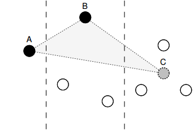

Largest Triangle is a sampler where, given two pre-determined points, the point in the bucket that forms the largest triangle has the largest effective area and so is the most important in the bucket. The three bucket implementation is where the two predetermined points are chosen from the buckets before and after the bucket being evaluated. The first point is the point chosen to represent the bucket before the current bucket. The second is a "ghost point" representing the next bucket, which is simply an average of the x and y values of that bucket.

<div class="text-center">
    

    <p>
        Image from [Downsampling Time Series for
        Visual Representation
        ](http://skemman.is/stream/get/1946/15343/37285/3/SS_MSthesis.pdf)
    </p>
</div>

The sampler requires both the `x` and `y` properties in order to calculate the area. You can configure the sampling frequency by setting the `bucketSize` property. As the Largest Triangle Three Bucket sampler computes areas, if you have a non-linear or discontinuous scale, the values supplied to the sampler must be scaled accordingly. You can apply the respective scales in the accessor functions as follows:

```js
    var sampler = fc.data.sampler.largestTriangleThreeBucket()
        .bucketSize(20)
        .x(function(d) { return xScale(d.date); })
        .y(function(d) { return yScale(d.low); });
```

The example below creates an array of 1,000 datapoints, sampling it using a bucket-size of 20:

```js
{{{example-code}}}
```

Which gives the following:

{{>example-fixture}}
